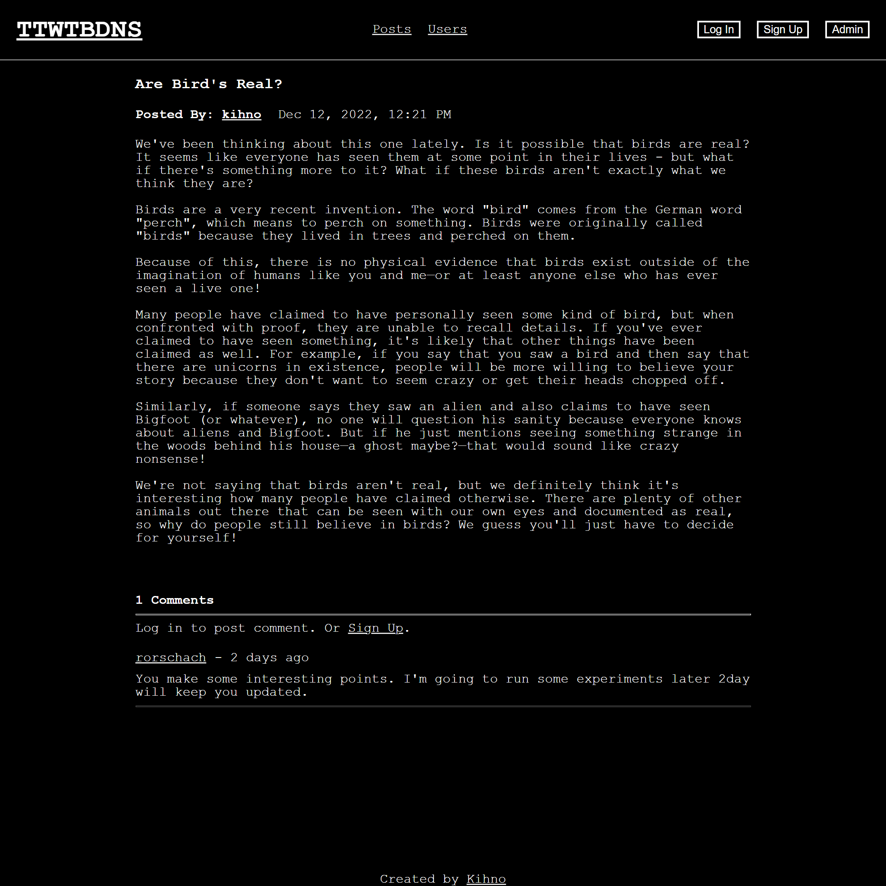

# Blog

https://blog-frontend-alm2.onrender.com/

## Description

A full-stack blog with a react front-end and express back-end, featuring [AI generated](https://copy.ai) conspiracy themed posts.

## Built With

- React
- React Router
- React Cookies
- Axios
- Express
- Pug
- MongoDB
- Passport Authentication

## Features

- Log in to post comments
- Users can update their own profiles
- Only admin can create posts and edit other user profiles

## Acknowledgements

Built as part of [The Odin Project](https://www.theodinproject.com/) full stack curriculm.
